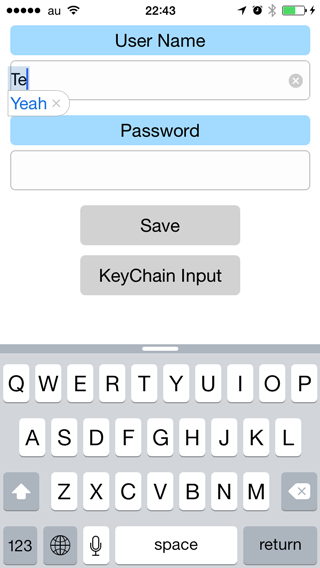

# Sample of UICKeyChainStore

This is a sample of [kishikawakatsumi/UICKeyChainStore](https://github.com/kishikawakatsumi/UICKeyChainStore).

# Install

1. `cd ~`
2. `git clone https://github.com/ShingoFukuyama/MySample_UICKeyChainStore`
3. `cd MySample_UICKeyChainStore`
4. `pod install`
5. Open MySample_UICKeyChainStore.xcworkspace in your Xcode

# iCloud
Do not need to configure `Capability > iCloud` or something.
All you need is just set `synchronizable` property to `YES`, and make sure your devices' iCloud Keychain are ON.

